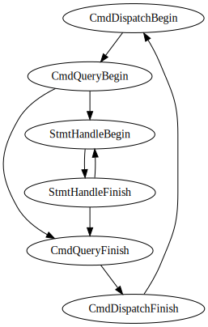

# go-litefsm

[](https://github.com/breeswish/go-litefsm/actions/workflows/workflow.yaml)
[](https://pkg.go.dev/github.com/breeswish/go-litefsm)
[](https://codecov.io/gh/breeswish/go-litefsm)

A deadly simple state machine for Golang, within 100 LOC.

## Example

```go
// Create accepted transitions
transitions := NewTransitions()
transitions.AddTransitFrom("CmdDispatchBegin").
  Into("CmdQueryBegin").
  ThenInto("CmdQueryFinish").
  ThenInto("CmdDispatchFinish").
  ThenInto("CmdDispatchBegin")
transitions.AddTransitFrom("CmdQueryBegin").
  Into("StmtHandleBegin").
  ThenInto("StmtHandleFinish").
  ThenInto("CmdQueryFinish")
transitions.AddTransitFrom("StmtHandleFinish").
  Into("StmtHandleBegin")

// Create a state machine over transitions
fsm := NewStateMachine(transitions, "CmdQueryBegin")

// Check valid transits
assert.Nil(fsm.CanGoto("StmtHandleBegin"))
assert.Nil(fsm.CanGoto("CmdQueryFinish"))
assert.ErrorIs(fsm.CanGoto("StmtHandleFinish"), ErrInvalidTransit)

// Or just transit the state
assert.Nil(fsm.Goto("StmtHandleBegin"))
assert.Nil(fsm.Goto("StmtHandleFinish"))
assert.Nil(fsm.Goto("StmtHandleBegin"))
assert.Nil(fsm.Goto("StmtHandleFinish"))
assert.Nil(fsm.Goto("CmdQueryFinish"))
```

The transition can be also visualized by using:

```go
transitions.DebugGraphviz() // digraph fsm { ... }
```


